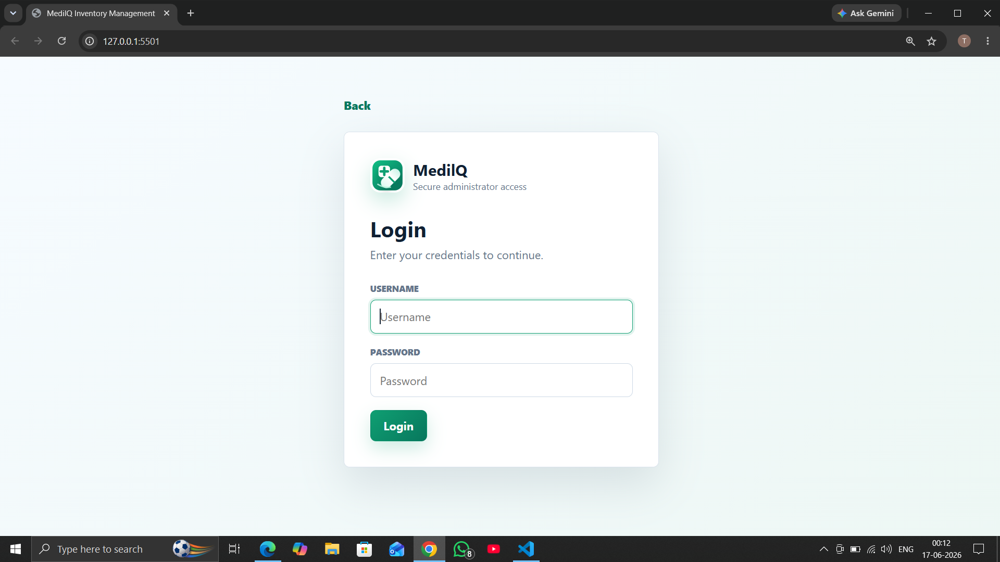
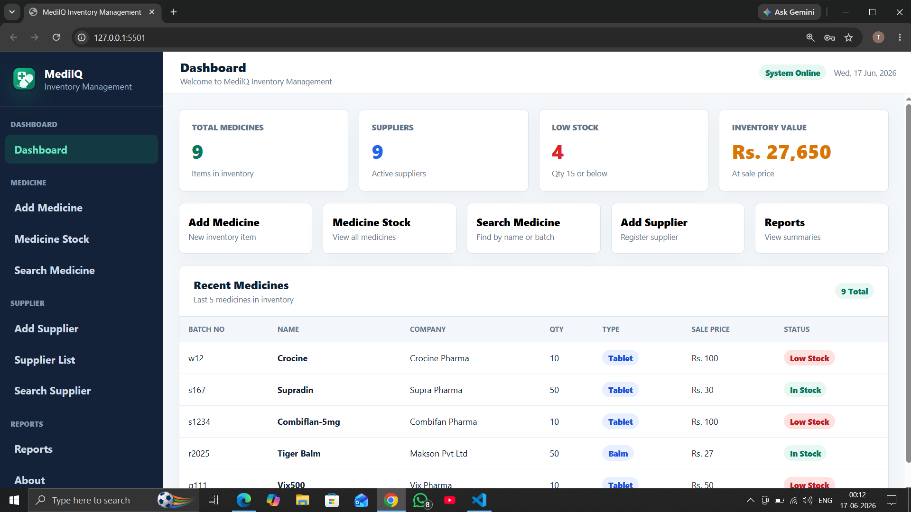
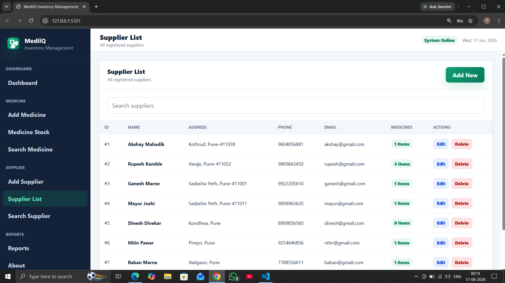
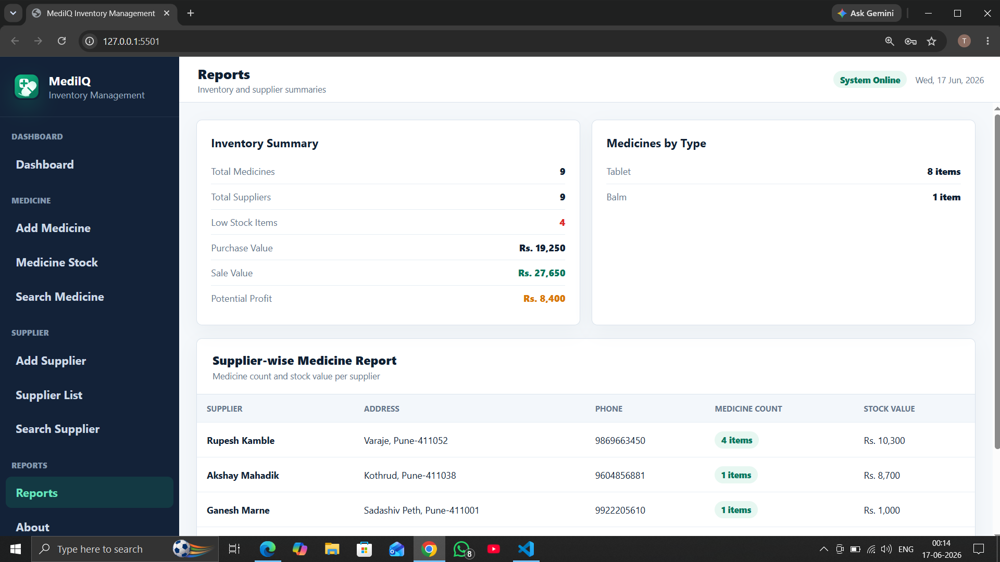

<div align="center">


# MedilQ

### Intelligent Medical Store Inventory Management System

**Smart Inventory • Supplier Management • Stock Tracking • Purchase Analytics**


### Modernizing Pharmacy Operations Through Smart Inventory Management

*Manage Medicines • Track Suppliers • Monitor Inventory • Generate Reports*

</div>

---

# 📖 Overview

MedilQ is a comprehensive Medical Store Inventory Management System designed to simplify pharmacy operations through efficient medicine inventory tracking, supplier management, stock monitoring, and purchase reporting.

The application provides an organized platform for managing medicines, suppliers, inventory records, and daily purchase reports while reducing manual effort and improving business productivity.

Built using Java, MySQL, HTML, CSS, and JavaScript, MedilQ demonstrates modular software architecture, CRUD operations, and efficient relational database management.

---

# ✨ Key Features

| Module | Description |
| ---------------------------- | -------------------------------------------- |
| 📦 Medicine Management | Add, Update, Delete & Search Medicines |
| 📊 Inventory Control | Monitor Medicine Stock |
| 🤝 Supplier Management | Manage Supplier Records |
| 📈 Purchase Reports | Daily Purchase Analytics |
| 🔍 Smart Search | Quick Record Lookup |
| 🔐 Login System | Secure User Authentication |
| 🗄️ Database Integration | MySQL Based Storage |
| ⚙️ CRUD Operations | Complete Data Management |

---

# 📸 Project Preview

## 🔐 Login Screen

<p align="center">

</p>

---

## 📊 Dashboard

<p align="center">

</p>

---

## 💊 Medicine Management

<p align="center">

</p>

---

## 🤝 Supplier Management

<p align="center">

</p>

---

## 📈 Purchase Report

<p align="center">

</p>

---


# 🏗️ System Architecture

```text
                           User

                             │

                             ▼

                Java Desktop Application

                             │

                   Business Logic Layer

                             │

        ┌────────────────────┼────────────────────┐
        │                    │                    │

  Medicine Module     Supplier Module     Report Module

        │                    │                    │

        └────────────────────┼────────────────────┘

                             │

                             ▼

                      MySQL Database

                             │

                             ▼

                Inventory & Business Records
```

---

# 🛠️ Technology Stack

| Category             | Technology         |
| -------------------- | ------------------ |
| Programming Language | Java               |
| Database             | MySQL              |
| Frontend             | HTML5              |
| Styling              | CSS3               |
| Client Scripting     | JavaScript         |
| Database Language    | SQL                |
| IDE                  | NetBeans / Eclipse |
| Version Control      | Git & GitHub       |

---

# 📊 Project Statistics

| Property       | Details                  |
| -------------- | ------------------------ |
| Project Type   | Desktop Application      |
| Domain         | Healthcare / Pharmacy    |
| Architecture   | Modular Java Application |
| Database       | MySQL                    |
| Design Pattern | CRUD-Based System        |
| License        | MIT                      |
| Status         | Active Development       |

---

# 📂 Project Structure

```text
MedilQ/

├── assets/
│   └── medilq-logo.svg
│
├── css/
│   └── style.css
│
├── js/
│   └── app.js
│
├── database/
│   └── medical_store.sql
│
├── java-src/
│   ├── Login.java
│   ├── MainMenu.java
│   ├── AddNewMedicine.java
│   ├── UpdateMedicine.java
│   ├── DeleteMedicine.java
│   ├── SearchMedicine.java
│   ├── MedicineList.java
│   ├── AddNewSupplier.java
│   ├── UpdateSupplier.java
│   ├── DeleteSupplier.java
│   ├── SearchSupplier.java
│   ├── SupplierList.java
│   ├── SupplierWiseMedList.java
│   ├── DailyPurchaseReport.java
│   ├── About.java
│   └── printer.java
│
├── screenshots/
│   ├── login.png
│   ├── dashboard.png
│   ├── medicine-management.png
│   ├── supplier-management.png
│   └── purchase-report.png
│
├── README.md
├── LICENSE
└── .gitignore
```

---

# 🚀 Getting Started

## Clone Repository

```bash
git clone https://github.com/Tanyyy-27/MedilQ.git
```

```bash
cd MedilQ
```

---

# ⚙️ Database Setup

Import the following SQL file into your local MySQL server.

```text
database/medical_store.sql
```

Create a new database and execute the SQL script to generate all required tables.

---

# 💻 Running the Application

### Compile Java Files

```bash
javac *.java
```

### Run the Application

```bash
java Login
```

---

# 🎯 Functional Modules

## 📦 Medicine Management

* Add Medicine
* Update Medicine
* Delete Medicine
* Search Medicine
* Medicine List

---

## 🤝 Supplier Management

* Add Supplier
* Update Supplier
* Delete Supplier
* Search Supplier
* Supplier List
* Supplier-wise Medicine List

---

## 📈 Reports

* Daily Purchase Report
* Inventory Monitoring
* Purchase Records
* Stock Management

---

# 🎓 Learning Outcomes

This project demonstrates practical understanding of:

* Object-Oriented Programming (OOP)
* Java Desktop Application Development
* Relational Database Design
* CRUD Operations
* Inventory Management Systems
* Software Engineering Principles
* MySQL Integration
* Modular Application Architecture

---


# 🛣️ Future Roadmap

MedilQ is designed with scalability in mind. The following features are planned for future releases:

### 📦 Inventory Enhancements

* ✅ Barcode Scanner Integration
* ✅ QR Code Medicine Lookup
* ✅ Automatic Stock Updates
* ✅ Low Stock Notifications

### 💼 Business Features

* ✅ GST Billing System
* ✅ Invoice Generation
* ✅ Customer Management
* ✅ Sales & Purchase Analytics

### 🔐 Security & Management

* ✅ Role-Based Authentication
* ✅ Admin & Staff Dashboard
* ✅ Activity Logs
* ✅ Secure Database Backup

### ☁️ Cloud Integration

* ✅ Cloud Database Support
* ✅ Multi-Store Inventory Management
* ✅ Online Synchronization
* ✅ Web-Based Dashboard

### 🤖 AI Features

* ✅ AI Stock Prediction
* ✅ Medicine Demand Forecasting
* ✅ Smart Purchase Recommendations
* ✅ Medicine Expiry Alerts

---

# 🌟 Why MedilQ?

MedilQ is built to simplify medical store operations by providing an intelligent and centralized inventory management solution.

### Key Benefits

* 📦 Organized Medicine Inventory
* 🤝 Efficient Supplier Management
* 📊 Better Business Insights
* ⚡ Faster Search Operations
* 🗄️ Reliable Database Management
* 🚀 Modular & Scalable Architecture

---

# 🤝 Contributing

Contributions, suggestions, and improvements are welcome.

### 1️⃣ Fork the Repository

### 2️⃣ Create a Feature Branch

```bash
git checkout -b feature/new-feature
```

### 3️⃣ Commit Your Changes

```bash
git commit -m "feat: add new feature"
```

### 4️⃣ Push to GitHub

```bash
git push origin feature/new-feature
```

### 5️⃣ Open a Pull Request

Your contributions help improve MedilQ for the developer community.

---

# 📜 License

This project is licensed under the **MIT License**.

Feel free to use, modify, and distribute this project in accordance with the license terms.

---

# 👨‍💻 Developer

## Tanmay Yenpure

**Computer Engineering Student • Full Stack Developer • Java Developer • Open Source Enthusiast**

Passionate about building scalable software solutions that solve real-world business problems through clean architecture, efficient database design, and modern software engineering practices.

### 🛠 Skills

* ☕ Java
* 🗄️ MySQL
* 🌐 HTML5
* 🎨 CSS3
* ⚡ JavaScript
* 🔧 Git & GitHub

---

### 🔗 Connect

**GitHub**

https://github.com/Tanyyy-27

---

# ⭐ Support the Project

If you found **MedilQ** useful or interesting,

please consider giving this repository a ⭐ on GitHub.

Your support motivates continuous improvements and future open-source contributions.

---

<div align="center">


# MedilQ

### Intelligent Medical Store Inventory Management System

**Building smarter pharmacy management solutions through modern software engineering.**

Made with ❤️ by **Tanmay Yenpure**

</div>


